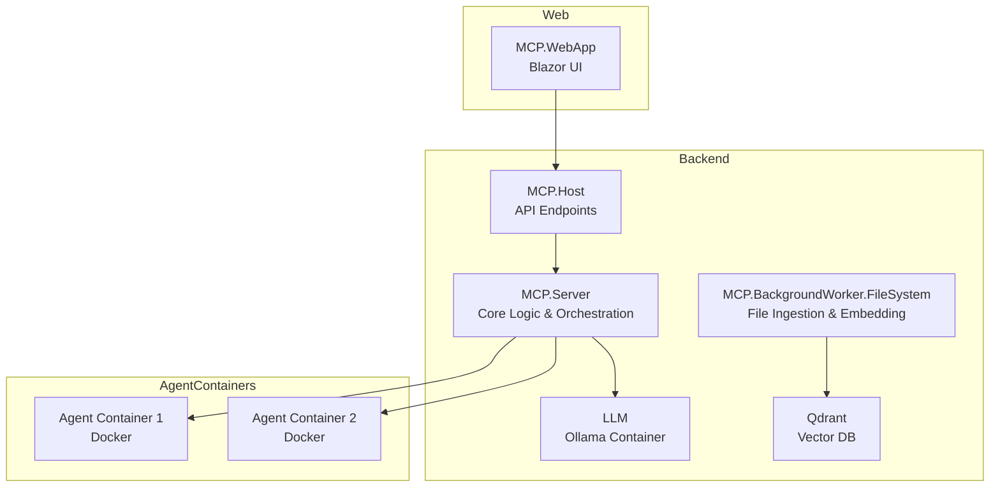

# Sphraiva Architecture Overview

Sphraiva is a modular C#/.NET application designed for local operation, implementing the Model Context Protocol (MCP) and Retrieval-Augmented Generation (RAG). The architecture consists of several main components:

- **MCP.WebApp**: The Blazor-based web front-end for user interaction.
- **MCP.Host**: Provides API endpoints and manages communication between agents and the server.
- **MCP.Server**: Handles core backend logic, agent orchestration, and workflow management.
- **LLM (Ollama Container)**: Large Language Model running in a dedicated Docker container for inference tasks.
- **MCP.BackgroundWorker.FileSystem**: Responsible for file system ingestion and embedding generation.
- **Qdrant**: Vector database for storing and searching embeddings.
- **Agent Containers**: Run in Docker containers and execute tasks as directed by the server.

Note: There is no direct communication between MCP.Server and MCP.BackgroundWorker.FileSystem. The BackgroundWorker operates independently and does not interact with the server component.

Qdrant and the LLM (Ollama container) are also part of the architecture. Qdrant stores embeddings generated by the BackgroundWorker and serves similarity search requests. The LLM in the Ollama container is used for inference and generation tasks, typically orchestrated by the MCP.Server or agents.

The following diagram illustrates the high-level architecture and interactions between these components:

